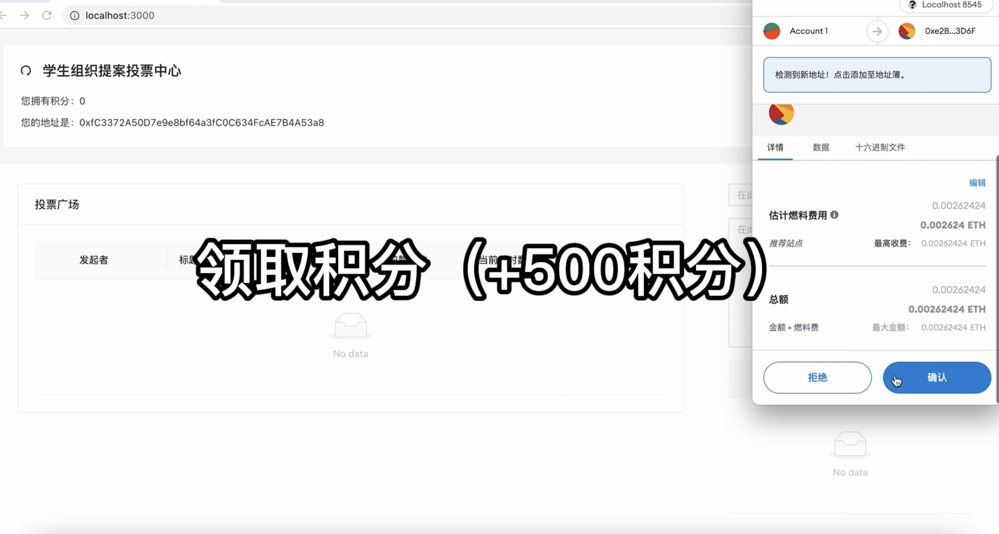
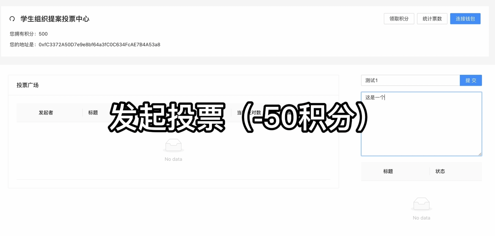
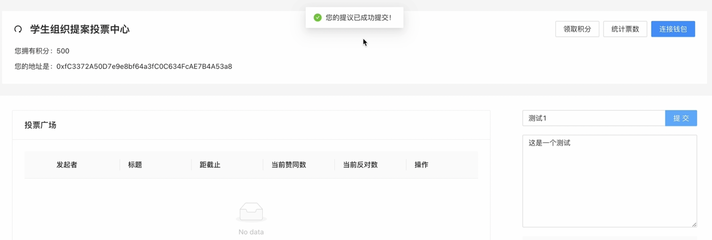
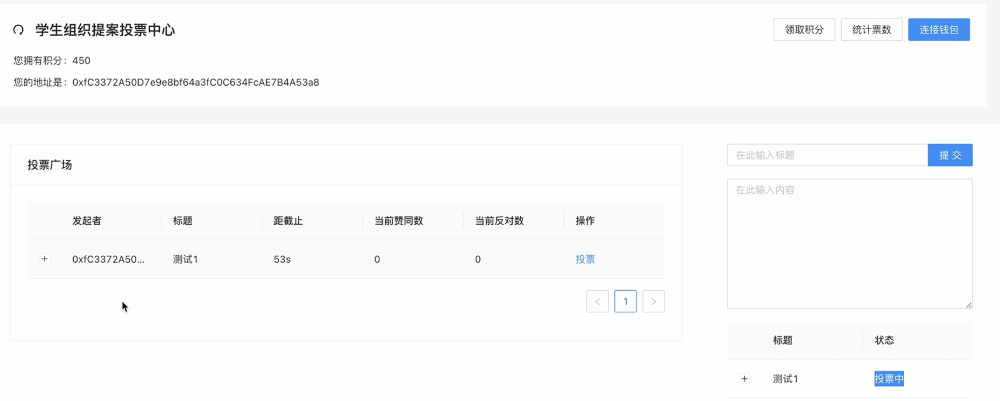
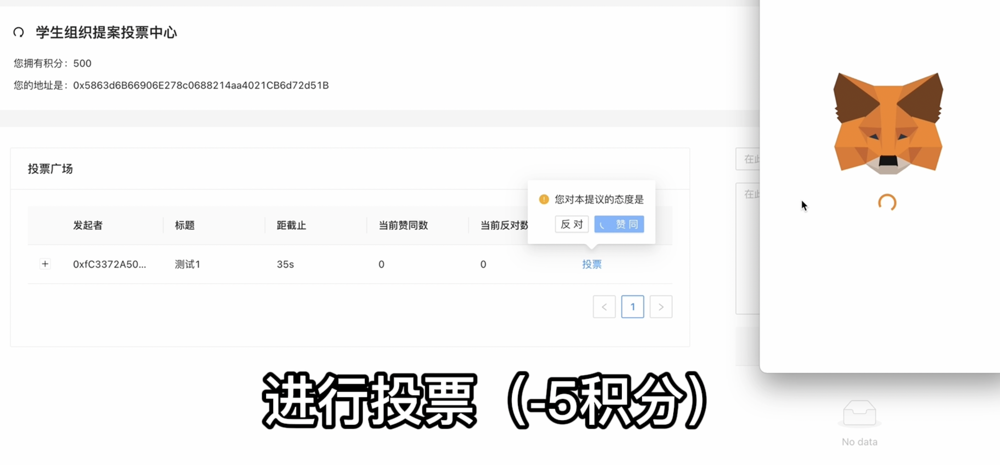
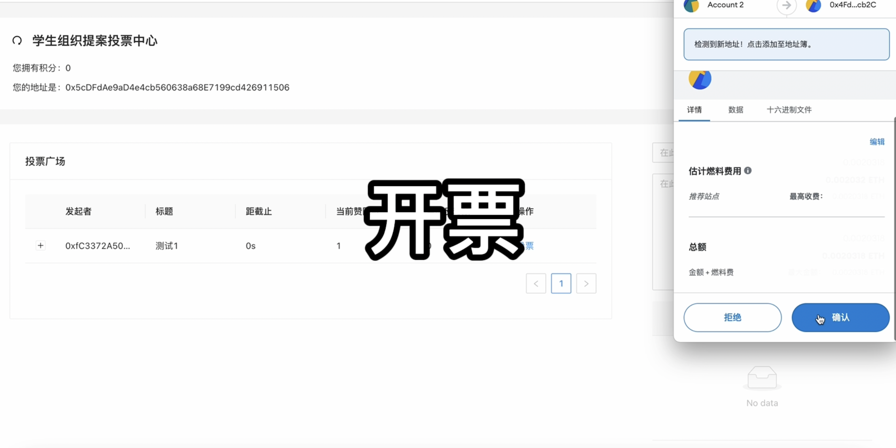
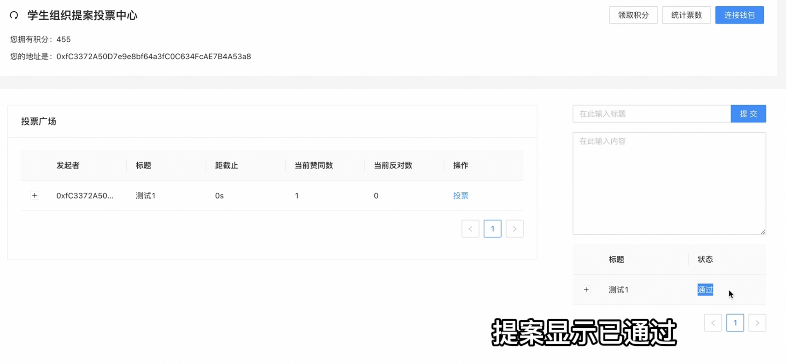

# Dapp-Community Proposing and Voting Platform

## 如何运行

1. 在本地启动ganache应用。

2. 在 `./contracts` 中安装需要的依赖，运行如下的命令：
    ```bash
    npm install
    ```
3. 在 `./contracts/contracts` 中编译合约，运行如下的命令：
    ```bash
    npx hardhat compile
    ```
4. 在`./contracts` 内部署合约，运行如下的命令：
    ```bash
    npx hardhat run ./scripts/deploy.ts --network ganache
    ```
5. 获取返回的contract的地址，并修改`./frontend/src/utils/contract-addresses.json`内的合约地址
    ```bash
    {
      "lottery": "0xCC4DF91cc9A9139A6D8285a3eABaEeD2Ed47003a", // 修改为部署得到的地址
      "myERC20": "0xA493F066d3B04C423b633511506246d70789C44A" // 修改为部署得到的地址
    }
    ```
6. 使用`./contracts/artifacts/contracts/Lottery.sol/Lottery.json`替换`./frontend/src/utils/abis/Lottery.json`；使用`./contracts/artifacts/contracts/Lottery.sol/MyER20.json`替换`./frontend/src/utils/abis/MyER20.json`
7. 在 `./frontend` 中安装需要的依赖，运行如下的命令：
    ```bash
    npm install
    ```
7. 在 `./frontend` 中启动前端程序，运行如下的命令：
    ```bash
    npm start
    ```

## 功能实现分析
0. 数据结构
  * 利用 `uint256 ID` 标识每条提议。
  * 利用 `mapping(uint256 => string) public PropName` 和 `mapping(uint256 => string) public PropData` 存储每个ID对应提议的标题与内容信息，利用 `mapping(uint256 => address) public PropInit` 存储每个ID对应提议的发起者的地址。
  * 利用 `mapping(uint256 => uint256) public VoteEnd` 存储每个ID对应提议的结束投票时间，利用 `mapping(uint256 => uint256) public TimeLeft`  存储每个ID对应提议的剩余投票时间，利用 `mapping(uint256 => uint256) public AyeCounts` 和 `mapping(uint256 => uint256) public NatCounts` 存储每个ID对应的提议的赞同票数和反对票数。
1. 连接钱包和积分获取
保留了框架内实现连接钱包功能的函数，通过MetaMask连接到用户的钱包。用户连接到钱包后，在前端显示用户的钱包地址。保留了框架内领取积分的函数，用户点击领取积分后，可领取500积分。

2. 提交提议
用户通过前端的两个Input框进行输入。在用户按下提交按钮后，前端发起合约调用交易，调用函数，新建一个提议，并扣除50积分。在提议新建成功后，将自动进入投票环节。

3. 查询提议信息
用户点击前端界面的刷新按钮授权访问后，前端发起合约调用交易，从合约账户取得相关信息，前端得到信息后将其渲染至表格，即可在前端显示自己提出的提议信息与当前平台内的所有提议信息。

4. 进行投票
用户成功提议信息后，可点击提议后的“操作”按钮并授权访问，对该提议进行投票。用户仅可在有效投票时间段内进行投票，投票动作将被记录在区块链上，投票成功后，该用户会被扣除5积分。

5. 计票与开票
使用管理员账户登陆（连接到管理员钱包），可使用开票功能。管理员点击前端的“统计投票”按钮并授权访问，即可对当前所有投票已结束但未开票的投票进行开票。开票后，根据投票情况将该提议标识为”通过“或”不通过“，并将该提议收到的所有投票产生的积分作为奖励全部转账给该提议的发起者。未通过的投票的发起者不会得到奖励。


## 项目运行截图








## 参考内容

课程的参考Demo见：[DEMOs](https://github.com/LBruyne/blockchain-course-demos)。

如果有其它参考的内容，也请在这里陈列。
